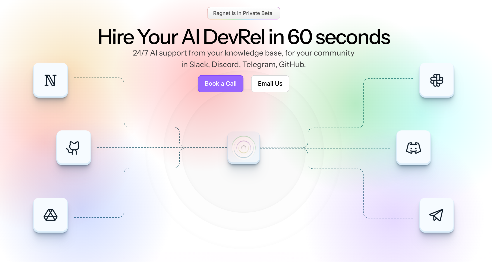
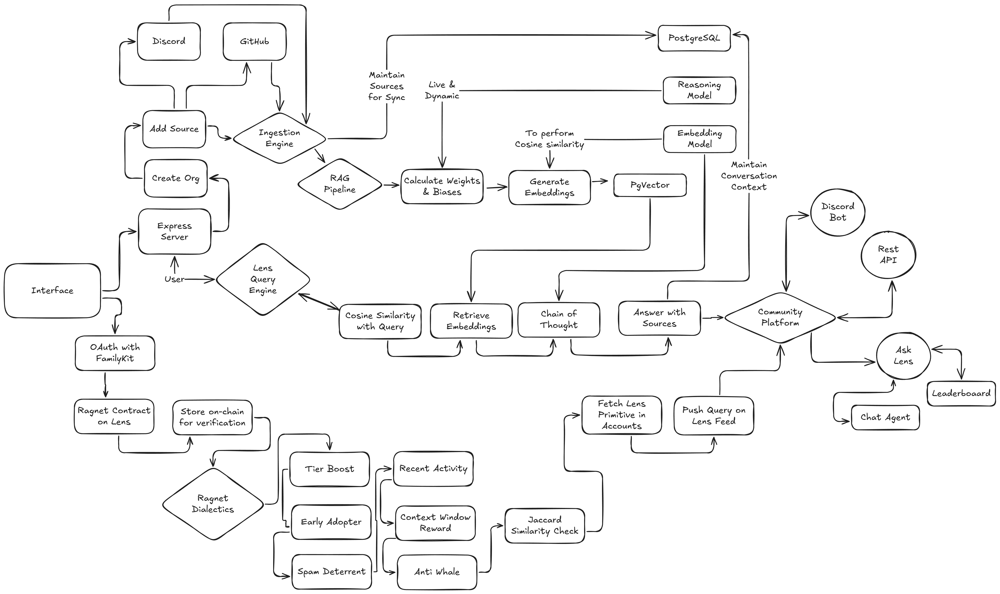

# RagNet: Your AI DevRel for Open Source Communities

<p align="center">
  
</p>

Ragnet is an AI-powered DevRel that automatically resolve developer support queries across community channels like Discord, Slack, GitHub, and Telegram specifically for your open source community.

Most open-source dev-facing startups struggle with scaling support: time zone delays, scattered knowledge, and growing community questions outpacing the team. Companies hire DevRels and Support Engineers to bridge this, but it's expensive and doesn’t scale well.

Ragnet solves this by ingesting your docs, codebase, GitHub issues, architecture diagrams, and past chat history to build an AI agent that answers dev queries instantly, with full source citations. It learns continuously from new interactions and works 24/7! like a fully trained DevRel who knows everything your team ever shipped, but without the human overhead. It’s baked right inside where your community is there’s 0 friction for them to use it.

## 🏗️ System Architecture

<p align="center">
  
</p>

## Key Features

- **Multi-Source Integration**

  - Discord communities
  - GitHub repositories
  - Documentation websites

- **Intelligent Query Processing**

  - RAG-based contextual understanding
  - Vector similarity search
  - Conversation history awareness
  - Source citations

- **Community Engagement**

  - Discord bot integration
  - Threaded conversations
  - Real-time responses
  - No auth required
  - Stays where your community is

- **Analytics & Insights**
  - Query patterns
  - User engagement metrics
  - Documentation coverage analysis

## Local Setup

### Prerequisites

- Node.js 20+
- Docker
- Discord Bot Token (for Discord integration)
- OpenAI API Key (for AI processing)

### Docker Compose Deployment

1. Clone the repository

```bash
git clone https://github.com/ragnet-in/infra.git
cd ragnet
```

2. Configure environment variables in docker-compose.yml

3. Start the server

```bash
docker compose up -d
```

Now access the application at `http://localhost:3000`

## 🔗 Lens Protocol Integration

RagNet integrates with Lens Protocol for:

1. **Social Identity**

   - Lens accounts & a common feed to subscribe to
   - Bonsai Smart Media Template for auto-debugging based on your error screenshots

2. **Content Verification**

   - On-chain verification of responses
   - Immutable query history
   - Transparent reputation system

3. **Engagement Rewards**
   - SOTA Jaccard-based reputation scoring
   - Early adopter bonuses
   - Engagement streaks

## 🛣️ Roadmap

### Phase 1: Core Features (Current)

- [x] Discord integration
- [x] GitHub Repo ingestion
- [x] Basic RAG implementation
- [x] Conversation threading

### Phase 2: Lens Integration

- [x] Social graph integration
- [x] Reputation system
- [x] Content verification
- [x] Bonsai App Integration with our Smart Media Template
- [ ] Token-gated features

### Phase 3: Enhanced Features

- [ ] Webpage crawling and ingestion
- [ ] Advanced analytics dashboard
- [ ] Custom training data support
- [ ] Multi-language support
- [ ] RAG Accuracy improvement with LLM

### Phase 4: Enterprise Features

- [ ] Custom model fine-tuning
- [ ] Team collaboration tools
- [ ] API rate limiting
- [ ] Custom deployment options

## 🛠️ Technical Stack

- **Backend**: Node.js, Express
- **Database**: PostgreSQL, pgvector
- **AI/ML**: OpenAI, Embeddings, Mastra
- **Web3**: Lens Protocol, Bonsai
- **Infra**: Docker, Docker Compose

## 📄 License

This project is licensed under the MIT License - see the [LICENSE](LICENSE) file for details.

<p align="center">Built with ❤️ by the RagNet Team</p>
